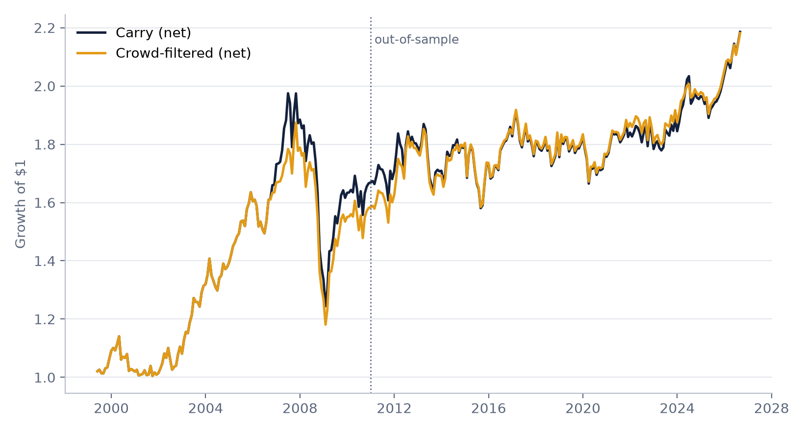
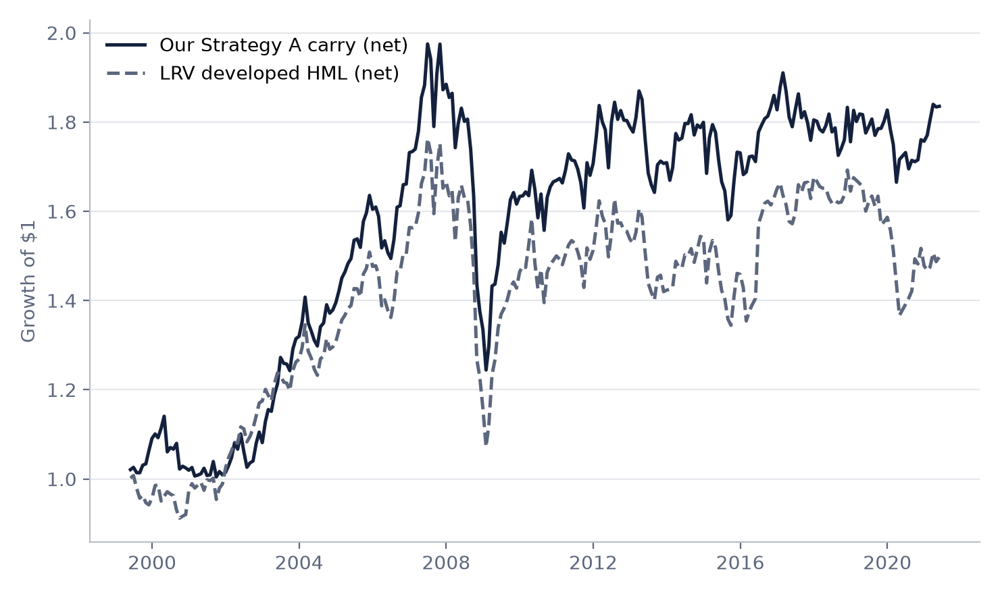
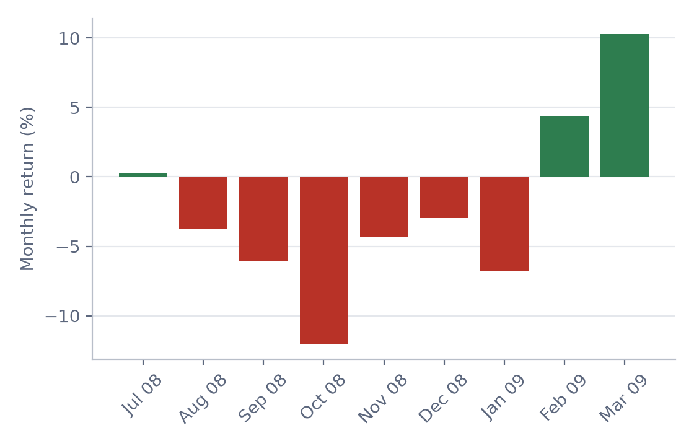
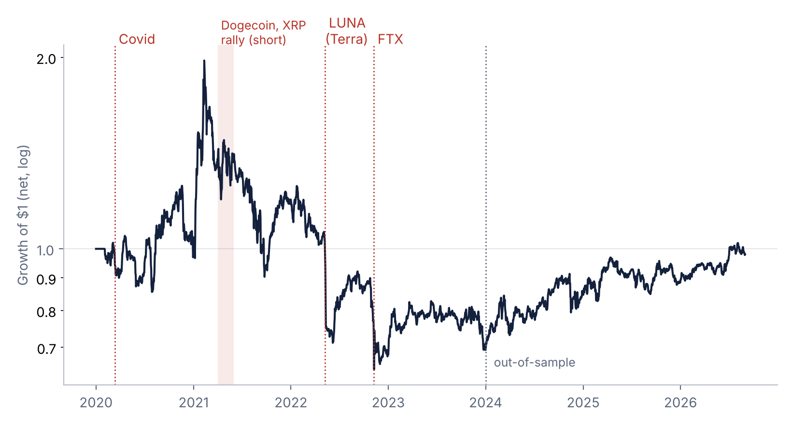
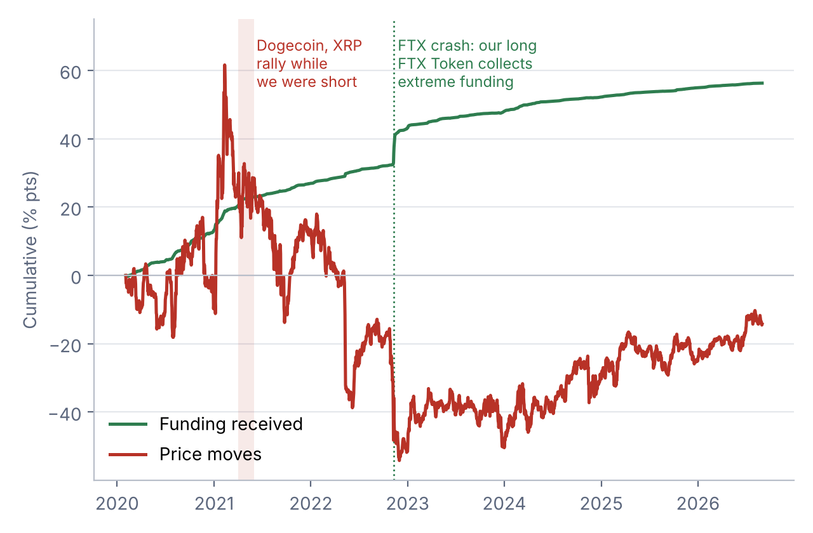
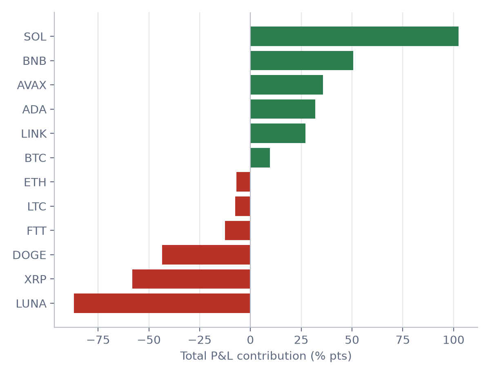
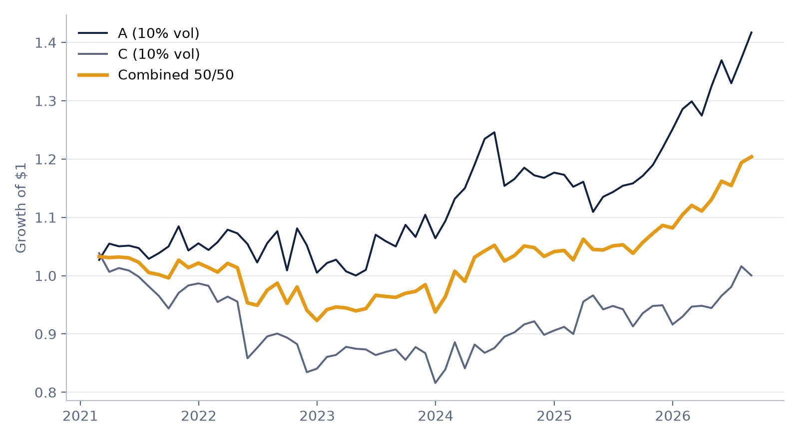

# Crowded Carry: Crash Risk in FX and Crypto Carry Trades

**MFE 230GB Currency Markets, final project**

Authors: Reza Zamani and Paraj Goyal · Professor: Amir Kermani

**GitHub repository:** [https://github.com/rezazamani2329/currency-crypto-carry](https://github.com/rezazamani2329/currency-crypto-carry)

**Presentation (10 minutes):** [`slides/presentation_10min.pptx`](slides/presentation_10min.pptx) · [PDF](slides/presentation_10min.pdf) · [slides with speaker notes (PDF)](slides/presentation_10min_with_notes.pdf) · speaker notes: [`md`](slides/speaker_notes_10min.md) · [PDF](slides/speaker_notes_10min.pdf)

**Other material:** interactive results page [`web/index.html`](web/index.html) · long deck [`slides/presentation.pptx`](slides/presentation.pptx) · step-by-step notebooks [`notebooks/`](notebooks/) · study guide [`docs/study-guide.html`](docs/study-guide.html) ([PDF](docs/study-guide.pdf), Persian [HTML](docs/study-guide-fa.html) / [PDF](docs/study-guide-fa.pdf)) · all online links [`docs/LINKS.md`](docs/LINKS.md)

---

## Contents

0. [Summary: question and answer](#0-summary-question-and-answer)
1. [Motivation](#1-motivation)
2. [Research question and sub-questions](#2-research-question-and-sub-questions)
3. [Hypotheses](#3-hypotheses)
4. [Data](#4-data)
5. [Approach: how the two strategies trade](#5-approach-how-the-two-strategies-trade)
6. [Model and formulas](#6-model-and-formulas)
7. [Methodology: keeping the tests honest](#7-methodology-keeping-the-tests-honest)
8. [Results](#8-results)
9. [Hypotheses: verdict and evidence](#9-hypotheses-verdict-and-evidence)
10. [Discussion](#10-discussion)
11. [What is new](#11-what-is-new)
12. [Limitations](#12-limitations)
13. [List of figures and tables](#13-list-of-figures-and-tables)
14. [Repository structure](#14-repository-structure)
15. [How to reproduce](#15-how-to-reproduce)
16. [AI use](#16-ai-use)

---

## 0. Summary: question and answer

**Our question: do carry trades crash when they are crowded?**

**Short answer: partly yes. Crowding makes carry weaker, but it doesn't predict the biggest crashes.**

- **FX:** carry crashes are compensation for risk, and crowding is a modest warning sign, not a
  reliable crash predictor. After crowded months, next-month carry averages 0.02% against 0.30%
  otherwise, and halving positions when crowded lifts the out-of-sample Sharpe ratio from 0.27 to
  0.32. But the 2008 crash started from a non-crowded reading, so the maximum drawdown is −37% with
  or without the filter.
- **Crypto:** carry also earns a premium and also crashes, but the crashes come from single coins,
  mostly being long a coin that traders are crowding to short, so crowding tells you where the
  danger is rather than when it will hit. Funding pays about 8.5% a year, but price moves decide the
  result (net Sharpe 0.14), and the worst week was the Terra (LUNA) collapse, −27%.
- **Together:** the two carry trades are almost uncorrelated (0.11), so a 50/50 mix has lower
  volatility and a smaller drawdown than either one alone.

| Headline numbers, net of costs | Net return a year | Volatility a year | Sharpe | Max drawdown |
|---|---|---|---|---|
| A: G10 carry, 1999–2026 | 3.3% | 8.9% | 0.37 | −37% |
| A: crowd-filtered carry, 1999–2026 | 3.2% | 8.5% | 0.38 | −37% |
| C: crypto funding carry, 2020–2026 | 4.1% | 30% | 0.14 | −67% |
| C: crypto funding carry, since 2024 | 13.9% | 17% | 0.81 | −13% |

## 1. Motivation

A carry trade buys high-yielding assets and funds them with low-yielding ones. Uncovered interest
parity (UIP) says this should earn nothing, because the high-yield currency should fall by exactly
the interest gap. In the data it earns a premium instead (the forward premium puzzle). The usual
explanation is crash risk: carry goes **"up the stairs and down the elevator"**, with small steady
gains most of the time and then large losses in a few weeks. Crashes are worst when the trade is
crowded and everyone unwinds at once (Brunnermeier, Nagel & Pedersen, 2008).

We test this in two markets with the same economics but very different investors:

| | **Strategy A: crowded G10 carry** | **Strategy C: crypto funding carry** |
|---|---|---|
| Market | Developed-market currencies | Crypto perpetual futures (Binance) |
| Universe | Japanese yen (JPY), euro (EUR), British pound (GBP), Swiss franc (CHF), Canadian dollar (CAD), Australian dollar (AUD), New Zealand dollar (NZD), each against the US dollar | Bitcoin (BTC), Ethereum (ETH), BNB, XRP, Cardano (ADA), Dogecoin (DOGE), Solana (SOL), Litecoin (LTC), Chainlink (LINK), Avalanche (AVAX), Terra (LUNA), FTX Token (FTT) |
| Carry signal | 3-month interest rate minus the US rate | Perpetual-futures funding rate |
| Crowding data | CFTC speculator positions | Funding itself measures leveraged demand |
| Rebalancing | Monthly | Weekly (Sunday), daily P&L |
| Sample | 1999-05 to 2026-08 | 2020-02 to 2026-08 |

## 2. Research question and sub-questions

**Main question: do carry trades crash when they are crowded?** We split it into six parts:

1. **RQ1.** Does G10 carry earn a positive risk-adjusted return after costs, and does it reproduce
   the academic carry factor?
2. **RQ2.** Does crowding, measured from CFTC positioning, predict weaker or more crash-prone carry,
   and does cutting exposure when crowded improve performance out of sample?
3. **RQ3.** When does FX carry lose money? Is it exposed to volatility shocks and the dollar factor?
4. **RQ4.** Does crypto funding carry (short high-funding coins, long low-funding coins) earn a
   premium after costs, and does the return come from funding or from price moves?
5. **RQ5.** What drives crypto carry losses?
6. **RQ6.** Are FX carry and crypto carry correlated, and does a combined portfolio diversify?

## 3. Hypotheses

The hypotheses and all trading parameters were written down **before** any backtest was run.

**Strategy A (crowded G10 carry)**

- **A1.** H0: G10 carry has zero expected excess return after costs. H1: it earns a positive
  premium.
- **A2.** H0: next-month carry is the same after crowded and non-crowded months. H1: after crowded
  months carry is weaker and more negatively skewed, so cutting exposure when crowded raises the
  out-of-sample Sharpe ratio.
- **A3.** H0: carry is unrelated to volatility shocks. H1: carry loses when volatility jumps.

**Strategy C (crypto funding carry)**

- **C1.** H0: short high-funding / long low-funding has zero expected return after costs. H1: it
  earns a positive premium, mainly from the funding it collects.
- **C2.** H0: its returns are driven by the crypto market. H1: being dollar-neutral, it has little
  BTC exposure, and its crashes are coin-specific.

**Additional test:** FX and crypto carry diversify each other.

## 4. Data

All data are public and were downloaded on 2026-10-02.

| Data | Source | Series / coverage | Used for |
|---|---|---|---|
| FX spot rates | FRED (Fed H.10), daily → month-end | DEXJPUS, DEXUSEU, DEXUSUK, DEXSZUS, DEXCAUS, DEXUSAL, DEXUSNZ | Strategy A returns |
| 3-month interbank rates | OECD via FRED, monthly | IR3TIB01xxM156N (US, JP, EZ, UK, CH, CA, AU, NZ, DE) | Strategy A carry signal |
| Speculator positions | CFTC Commitments of Traders, legacy futures-only, weekly | CME currency futures, 1986–2026 | Strategy A crowding signal |
| Crypto price, volume, funding | Binance public archive (data.binance.vision), USDT-margined perpetuals | Daily candles and 8-hourly funding, 2020-01 to 2026-08 | Strategy C |
| Carry factor portfolios | Lustig, Roussanov & Verdelhan, *CurrencyPortfolios.xls* (course file) | Developed-country HML, dollar factor RX and equity-volatility innovations, 1983–2021 | Validation and risk regressions |

Coverage of the cleaned data in `data/clean/`:

- **FX spot:** JPY, GBP, CHF, CAD, AUD, NZD from 1971-01; EUR from 1999-01. All to 2026-09.
- **3-month rates:** long histories for USD, EUR/DEM, GBP, CAD, AUD and NZD, but JPY only from
  2002-04 and CHF from 1999-07; GBP ends 2026-01. Strategy A therefore starts in 1999-05.
- **CFTC positions:** CAD, CHF, EUR (Deutsche mark before 1999), GBP and JPY from 1986-01, AUD from
  1987-01, NZD from 1999-01 (no NZD contract from 2000-04 to 2003-11).
- **Crypto:** the 12 coins above, plus USDC as a stablecoin sanity check (not traded). Average
  annualised funding is about 12–15% on the main coins (BTC 11.8%, ETH 13.9%, XRP 14.7%) and
  positive on 81–88% of days.
- **Data fix:** before August 2000 the CFTC lists currency futures under the exchange name
  "INTERNATIONAL MONETARY MARKET". Matching both names extends positioning back to 1986.

## 5. Approach: how the two strategies trade

Each step uses only data available at the time of the trade.

**Strategy A: G10 FX carry, monthly**

1. **Month-end: rank.** Compute each currency's 3-month interest rate minus the US rate.
2. **Trade.** Buy the 2 highest-rate currencies and sell the 2 lowest, 50% of capital in each leg,
   so there is no net dollar bet.
3. **Crowding check.** For each currency take speculators' net futures position from the CFTC
   report. The report shows Tuesday positions and is published on Friday, so it is used only from
   Friday. Z-score it over 36 months. Portfolio crowding is the average z of the currencies we buy
   minus the average z of those we sell. If crowding is above 1, halve all positions.
4. **Hold one month** and earn the currency move plus the interest-rate gap.
5. **Rebalance** at the next month-end: rank again and swap, paying 3 bp per unit traded.

In practice the portfolio is almost always long the New Zealand dollar (94% of months) and the
Australian dollar (75%), and short the Swiss franc (99%), often with the yen (52%) or the euro (40%).
33 of 328 months were crowded.

**Strategy C: crypto funding carry, weekly**

1. **Sunday close: rank.** Average each coin's daily funding rate over the past 7 days, using data up
   to the day before. A coin counts only on days it has a price and positive volume.
2. **Trade.** Short the third of coins with the highest funding and buy the lowest third, equal
   weights, 50% of capital in each leg (dollar-neutral). This is usually 3 coins on each side: 2 in
   early 2020 and briefly 4 in 2022, because the 12 coins were never all trading at once.
3. **Hold 7 days.** Earn the price move plus funding; a short receives funding when it is positive.
4. **Rebalance** next Sunday: rank again and swap, paying 5 bp per unit traded.

There is no separate crowding filter in C, because high funding already is a crowding signal.

## 6. Model and formulas

**Currency excess return (A).** With S in USD per foreign currency unit and i the 3-month rate in
percent a year:

```
rx(k,t) = (1 + i(k,t-1)/1200) * S(k,t)/S(k,t-1) - (1 + i(US,t-1)/1200)
```

This is the return on a one-month forward position under covered interest parity.

**Carry weights (A).** At month-end t, rank currencies by `i(k,t) - i(US,t)`; weight +0.5 on each of
the top 2 and −0.5 on each of the bottom 2. Portfolio return in month t+1:
`r(t+1) = Σ w(k,t) · rx(k,t+1)`.

**Crowding signal (A).**

```
pos(k,t)  = (non-commercial long - non-commercial short) / open interest   (last release by month-end)
z(k,t)    = (pos(k,t) - 36-month mean) / 36-month std                       (minimum 24 months)
crowd(t)  = Σ w(k,t) · z(k,t)  = average z of longs - average z of shorts
scale(t)  = 0.5 if crowd(t) > 1, else 1
```

**Crypto funding carry (C).** Signal `f(c,t)` = trailing 7-day average of daily funding, using data
up to day t. Every Sunday, weight −0.5/k on the k highest-funding coins and +0.5/k on the k lowest,
with k = one third of tradable coins. Daily P&L per coin:

```
pnl(c,t+1) = w(c,t) * price return(c,t+1)  -  w(c,t) * funding paid(c,t+1)
```

A short (w < 0) therefore receives positive funding.

**Return decomposition (C).** Net P&L = funding component + price component − costs.

**Transaction costs.** `cost(t) = turnover(t) × c`, with turnover = Σ |w(t) − w(t−1)| and c = 3 bp
(FX) or 5 bp (crypto).

**Risk regressions.** Newey-West t-statistics (3 lags monthly, 7 lags daily):

```
r_A(t) = α + β_RX · RX(t) + β_vol · ΔVol(t) + ε(t)        monthly, 1999-05 to 2021-05
r_C(t) = α + β_BTC · r_BTC(t) + ε(t)                       daily
```

**Performance statistics.** Annualised mean, volatility and Sharpe ratio (×12 for monthly data, ×365
for daily data, square root of these for volatility), maximum drawdown, skewness, worst period, hit
rate and turnover.

**Combined portfolio.** Each strategy is scaled to 10% annual volatility using trailing volatility
known at t−1 (36 months for A, 12 for C), then combined 50/50.

## 7. Methodology: keeping the tests honest

- **Pre-specified parameters.** Legs, windows, thresholds, lookbacks, rebalancing and costs were
  fixed before the backtests and not changed afterwards.
- **In-sample / out-of-sample split.** A: in-sample 1999–2010, out-of-sample 2011–2026.
  C: in-sample 2020–2023, out-of-sample 2024–2026.
- **Costs.** 3 bp per unit traded for G10 FX and 5 bp for crypto; results are shown gross and net.
- **No look-ahead.** Weights set at the end of t earn the return of t+1. CFTC positions (Tuesday)
  are used only after their Friday release. Crypto signals use funding up to the previous day.
- **No survivorship bias.** Terra (LUNA) and FTX Token (FTT), which collapsed in 2022, stay in the
  universe. A coin is tradable only on days with a price and positive volume, which removes LUNA
  after 2022-05 and FTT after 2022-11-14. Only the 5 days missing from Binance's archive are
  forward-filled.
- **Robustness reported, not used for tuning.** Grids over the crowding threshold and exposure (A)
  and over lookback × rebalancing (C) are reported in full; headline results stay pre-specified.
- **External validation.** Strategy A is compared with the Lustig–Roussanov–Verdelhan developed HML
  carry factor.

## 8. Results

All numbers are read from the files in [`output/`](output/). Returns are net of costs unless stated.

### 8.1 Strategy A: G10 carry and the crowding filter (RQ1, RQ2)

**Figure 1. Growth of $1, carry vs crowd-filtered carry (net).**



**Table 1. Strategy A performance.**

| Net of costs | Period | Ann. mean | Ann. vol | Sharpe | Max DD | Skew | Turnover |
|---|---|---|---|---|---|---|---|
| Carry | Full 1999-05 to 2026-08 | 3.27% | 8.91% | 0.37 | −37.0% | −0.49 | 1.2x |
| Carry | In-sample 1999–2010 | 4.96% | 10.55% | 0.47 | −37.0% | −0.71 | 1.6x |
| Carry | Out-of-sample 2011–2026 | 2.01% | 7.46% | 0.27 | −15.5% | −0.10 | 0.9x |
| Crowd-filtered | Full | 3.23% | 8.55% | 0.38 | −37.0% | −0.45 | 2.0x |
| Crowd-filtered | In-sample | 4.47% | 10.12% | 0.44 | −37.0% | −0.69 | 1.8x |
| Crowd-filtered | Out-of-sample | 2.31% | 7.16% | **0.32** | −14.4% | −0.02 | 2.1x |

**Table 2. Carry in the month after crowded vs non-crowded months.**

| | Months | Next-month mean | Next-month vol | Skewness |
|---|---|---|---|---|
| Not crowded | 295 | 0.30% | 2.56% | −0.46 |
| Crowded | 33 | **0.02%** | 2.67% | −0.71 |

**Table 3. Robustness of the crowding filter (net Sharpe).**

| Threshold | Exposure when crowded | Sharpe full | Sharpe out-of-sample |
|---|---|---|---|
| 0.5 | 0% | 0.37 | 0.31 |
| 0.5 | 50% | 0.38 | 0.30 |
| 1.0 | 0% | 0.38 | 0.37 |
| **1.0** | **50% (pre-set)** | **0.38** | **0.32** |
| 1.5 | 0% | 0.35 | 0.39 |
| 1.5 | 50% | 0.36 | 0.33 |

Every setting beats plain carry out of sample (0.27).

**Figure 2. Strategy A vs the academic LRV carry factor.**



**Validation (RQ1).** Over 1999-05 to 2021-05 (264 months), Strategy A has a **0.82 correlation**
with the LRV developed HML factor (Strategy A 3.22% a year, Sharpe 0.34; LRV HML 2.34%, Sharpe 0.23).

The full diagnostic chart from the backtest script (cumulative returns, drawdowns and the crowding
signal) is [`output/strategyA/strategyA_performance.png`](output/strategyA/strategyA_performance.png).

### 8.2 Strategy A: when does it lose money? (RQ3)

**Table 4. Monthly net carry on risk factors, 1999-05 to 2021-05, Newey-West t-statistics.**

| Model | Dollar factor (RX) | Volatility innovation | Monthly alpha | R² |
|---|---|---|---|---|
| RX only | 0.42 (t = 4.4) | – | 0.26% (t = 1.6) | 0.12 |
| Volatility only | – | −1.93 (t = −4.3) | 0.26% (t = 1.6) | 0.10 |
| Both | 0.35 (t = 4.1) | **−1.55 (t = −3.7)** | 0.25% (t = 1.7) | 0.18 |

**Figure 3. The 2008 carry crash, monthly returns July 2008 to March 2009.**



From July 2008 to March 2009 the strategy lost **−20.5%**, as the funding currencies (yen and Swiss
franc) rallied against the Australian and New Zealand dollars. Worst months: 2008-10 (−12.0%),
2007-08 (−7.8%), 2000-05 (−7.0%), 2009-01 (−6.8%), 2008-03 (−6.5%) and 2015-01 (−6.4%, the Swiss
franc de-peg).

### 8.3 Strategy C: crypto funding carry (RQ4)

**Figure 4. Growth of $1, crypto funding carry (net, log scale), with the main events.** The red band
marks the Dogecoin and XRP rally of April–May 2021 while the strategy was short them.



**Table 5. Strategy C performance.**

| | Period | Ann. mean | Ann. vol | Sharpe | Max DD | Worst week | Turnover |
|---|---|---|---|---|---|---|---|
| Gross | Full 2020-02 to 2026-08 | 6.38% | 29.87% | 0.21 | −66.0% | −27.2% | 45x |
| Net | Full | 4.13% | 29.87% | **0.14** | −67.3% | −27.3% | 45x |
| Net | In-sample 2020–2023 | −2.52% | 36.05% | −0.07 | −67.3% | −27.3% | 45x |
| Net | Out-of-sample 2024–2026 | 13.87% | 17.21% | **0.81** | −13.3% | −9.2% | 44x |

**Figure 5. Cumulative funding received vs price moves.** The dotted green line marks the FTX crash
(November 2022), when the strategy was long FTX Token and collected extreme funding.



**Table 6. Where the return comes from (% a year).**

| Period | Funding | Price | Costs | Net |
|---|---|---|---|---|
| Full | +8.55 | −2.17 | −2.25 | +4.13 |
| In-sample | +12.26 | −12.51 | −2.27 | −2.52 |
| Out-of-sample | +3.10 | +12.99 | −2.22 | +13.87 |

**Table 7. Robustness, lookback × rebalancing (net Sharpe).**

| Lookback | Rebalancing | Sharpe full | Sharpe out-of-sample |
|---|---|---|---|
| 3 days | daily | 0.68 | 0.41 |
| 3 days | weekly | 0.49 | 1.29 |
| 7 days | daily | 0.56 | 0.92 |
| **7 days** | **weekly (pre-set)** | **0.14** | **0.81** |
| 30 days | daily | 0.28 | 0.83 |
| 30 days | weekly | 0.07 | 0.42 |

All 6 settings have a positive out-of-sample Sharpe (0.41 to 1.29), and the pre-set choice is in the
bottom half, so we did not pick the best one after the fact.

The full diagnostic chart from the backtest script is
[`output/strategyC/strategyC_performance.png`](output/strategyC/strategyC_performance.png).

### 8.4 Strategy C: what drives the losses? (RQ5)

- **No market exposure.** Beta to daily BTC returns is −0.02 (Newey-West t = −0.75).
- **The worst week was Terra.** In the week ending 2022-05-15 the strategy lost −27.3%. It was
  *long* Terra: traders were shorting it, its 7-day funding had turned negative (about −20% a year),
  so the rule put it in the long leg. Other bad weeks: 2021-09-12 −12.3%, 2022-11-13 −11.6% (FTX),
  2020-11-29 −11.0%, 2021-08-15 −10.0%.

**Figure 6. Total P&L contribution by coin (% points).**



Losses are coin-specific: Terra −87, XRP −58, Dogecoin −44, FTX Token −13; winners Solana +102,
BNB +51, Avalanche +36, Cardano +32, Chainlink +27.

### 8.5 Combined portfolio (RQ6)

**Figure 7. A and C scaled to 10% volatility, and the 50/50 mix, 2021–2026.**



**Table 8. Combined portfolio, 2021-02 to 2026-08 (67 months).**

| | Ann. mean | Ann. vol | Sharpe | Max DD | Worst month |
|---|---|---|---|---|---|
| A (10% vol) | 6.70% | 9.43% | 0.71 | −11.0% | −7.4% |
| C (10% vol) | 0.44% | 9.28% | 0.05 | −21.4% | −10.2% |
| Combined 50/50 | 3.57% | 6.96% | 0.51 | −10.6% | −5.9% |

The correlation between A and C is **0.11** (0.12 for unscaled monthly net returns, 78 months).

## 9. Hypotheses: verdict and evidence

**Table 9. Verdict on each hypothesis.**

| Hypothesis | Verdict | Evidence |
|---|---|---|
| A1: G10 carry earns a premium | **Supported** | Net Sharpe 0.37; 0.82 correlation with the LRV factor |
| A2: crowding predicts weaker carry | **Leaning yes** | 0.02% vs 0.30% next month; out-of-sample Sharpe 0.27 → 0.32; missed 2008 |
| A3: carry loses in volatility spikes | **Supported** | Volatility beta −1.55 (t = −3.7); alpha not significant |
| C1: funding carry earns a premium | **Mixed** | Funding +8.5% a year, but net Sharpe 0.14; price moves dominate |
| C2: no BTC exposure; coin-specific crashes | **Supported** | BTC beta ≈ 0; Terra −87 points; worst week −27% |
| FX and crypto carry diversify | **Supported** | Correlation 0.11; combined volatility 7.0% vs about 9% |

## 10. Discussion

- **Strategy A (RQ1–RQ3).** G10 carry earns a modest premium (net Sharpe 0.37) and tracks the
  academic carry factor closely (correlation 0.82). Its losses line up with volatility shocks (beta
  −1.55, t = −3.7), and the alpha is not significant once the dollar and volatility factors are
  included. This is the textbook picture: carry is pay for crash risk, not a free lunch.
- **Crowding (RQ2).** The evidence leans towards H1-A2 but is not decisive. After crowded months
  carry earns almost nothing and is more negatively skewed, and the filter raises the out-of-sample
  Sharpe from 0.27 to 0.32, with every setting in the robustness grid beating plain carry. But with
  only 33 crowded months the difference is imprecise, and the 2008 crash started from a non-crowded
  reading, so the filter did not avoid the largest drawdown.
- **Strategy C (RQ4–RQ5).** Crypto carry collects real funding income (+8.5% a year), but price moves
  dominate. In 2020–2023 the shorted, crowded-long coins such as Dogecoin and XRP kept rallying and
  wiped out the funding; since 2024 most of the gain came from price, not funding. The strategy has
  no BTC exposure, but its crashes are coin-specific and arise in the mirror image of FX: because it
  buys the coins with the most negative funding, it ends up long whatever traders short hardest. In
  2022 that meant being long Terra and FTX Token into their collapse.
- **Diversification (RQ6).** FX and crypto carry are nearly uncorrelated (0.11), so the 50/50 mix has
  lower volatility (7.0%) and a smaller drawdown than either part. Because C was weak during the
  overlap, the mix does not beat A alone on Sharpe.
- **Implications.** In FX, crowding from positioning data is a cheap, modestly useful overlay. In
  crypto, sorting on funding alone exposes the portfolio to single-coin collapses; a better design
  would react faster than weekly (the robustness grid points that way), treat extreme negative
  funding as a sign of crowded shorts, and size positions by coin-level risk.

## 11. What is new

- We use **CFTC speculator positioning as a crowding filter** on G10 carry, and test it out of
  sample.
- We treat **crypto funding as both the crypto interest-rate gap and a crowding signal**, and test it
  on a universe that keeps the coins that died (Terra and FTX Token).
- We compare the two markets side by side with the same pre-registered design, and show that their
  crashes come from opposite sides of the crowd.

## 12. Limitations

- **Short crypto history.** About 6.5 years and only 12 coins; each leg usually holds 3 coins, so
  single-coin events dominate.
- **Few crowded FX months.** Only 33 crowded months, and the 2008 crash was not flagged.
- **Strategy C reverses** between in-sample (Sharpe −0.07) and out-of-sample (0.81). The
  out-of-sample period is short and benefited from price moves, so it is not evidence of a stable
  premium.
- **Signal horizon matters.** Shorter lookbacks and daily rebalancing do better even after costs;
  we report the pre-set case and did not switch after seeing the grid.
- **Data gaps.** EUR spot starts in 1999 (DEXGEUS not used), JPY rates in 2002 and CHF rates in 1999,
  so Strategy A starts in 1999-05. The LRV factors end in 2021-05, so the risk regressions cover
  1999–2021 only.
- **Simple costs.** Costs are per-unit estimates; funding caps, borrow limits, slippage under stress
  and exchange counterparty risk are not modelled.

## 13. List of figures and tables

| | Content | File |
|---|---|---|
| Figure 1 | Strategy A: growth of $1, carry vs crowd-filtered | [`slides/img/a_cum.png`](slides/img/a_cum.png) |
| Figure 2 | Strategy A vs LRV carry factor | [`slides/img/a_lrv.png`](slides/img/a_lrv.png) |
| Figure 3 | The 2008 carry crash, monthly returns | [`slides/img/a_2008.png`](slides/img/a_2008.png) |
| Figure 4 | Strategy C: growth of $1 with events | [`slides/img/c_cum_annotated.png`](slides/img/c_cum_annotated.png) |
| Figure 5 | Strategy C: funding vs price P&L | [`slides/img/c_decomp_annotated.png`](slides/img/c_decomp_annotated.png) |
| Figure 6 | Strategy C: P&L by coin | [`slides/img/c_contrib.png`](slides/img/c_contrib.png) |
| Figure 7 | Combined portfolio | [`slides/img/comb.png`](slides/img/comb.png) |
| Extra | Strategy A diagnostics | [`output/strategyA/strategyA_performance.png`](output/strategyA/strategyA_performance.png) |
| Extra | Strategy C diagnostics | [`output/strategyC/strategyC_performance.png`](output/strategyC/strategyC_performance.png) |
| Table 1 | Strategy A performance | [`output/strategyA/performance_table.csv`](output/strategyA/performance_table.csv) |
| Table 2 | Carry after crowded vs non-crowded months | [`output/strategyA/crowded_vs_not.csv`](output/strategyA/crowded_vs_not.csv) |
| Table 3 | Strategy A robustness grid | [`output/strategyA/robustness_grid.csv`](output/strategyA/robustness_grid.csv) |
| Table 4 | Strategy A factor regressions | [`output/risk/A_factor_regressions.csv`](output/risk/A_factor_regressions.csv) |
| Table 5 | Strategy C performance | [`output/strategyC/performance_table.csv`](output/strategyC/performance_table.csv) |
| Table 6 | Strategy C return decomposition | [`output/strategyC/return_decomposition.csv`](output/strategyC/return_decomposition.csv) |
| Table 7 | Strategy C robustness grid | [`output/strategyC/robustness_grid.csv`](output/strategyC/robustness_grid.csv) |
| Table 8 | Combined portfolio | [`output/risk/combined_portfolio.csv`](output/risk/combined_portfolio.csv) |
| Table 9 | Hypotheses: verdict and evidence | this README, section 9 |

Other outputs: LRV comparison [`A_vs_LRV_HML.csv`](output/risk/A_vs_LRV_HML.csv), worst months
[`A_worst_months.csv`](output/risk/A_worst_months.csv), BTC beta [`C_beta_btc.csv`](output/risk/C_beta_btc.csv),
coin contributions [`C_contribution_by_coin.csv`](output/risk/C_contribution_by_coin.csv), worst weeks
[`C_worst_weeks.csv`](output/risk/C_worst_weeks.csv), and the monthly and daily return series in each
`output/` folder.

## 14. Repository structure

```
code/          numbered scripts, run in order (see run_all.py)
  01_download_data_strategyA.py   FX, rates, CFTC  -> data/clean/
  02_backtest_strategyA.py        Strategy A backtest -> output/strategyA/
  03_download_data_strategyC.py   Binance prices and funding -> data/clean/
  04_backtest_strategyC.py        Strategy C backtest -> output/strategyC/
  05_risk_analysis.py             LRV check, risk, combined -> output/risk/
  06_build_web.py                 interactive page -> web/index.html
  07_build_slides.py              long deck and charts -> slides/presentation.pptx, slides/img/
  08_build_slides_10min.py        10-minute deck with speaker notes -> slides/presentation_10min.pptx
notebooks/     step-by-step Jupyter versions of the scripts (01-05)
data/raw/      raw downloads as received (FRED, CFTC, Binance, LRV file)
data/clean/    processed data snapshot used for all results (committed)
output/        result tables (CSV) and diagnostic figures
slides/        presentations, speaker notes and chart images (slides/img/)
web/           interactive HTML page
docs/          study guide (HTML and PDF, English and Persian)
ai_log.md      documentation of AI-assisted work
```

## 15. How to reproduce

```bash
conda create -n carry python=3.12 -y   # or use your own environment
conda activate carry
pip install -r requirements.txt
SKIP_DOWNLOAD=1 python run_all.py      # all results, page and slides from the committed data/clean snapshot
python run_all.py                      # full pipeline including downloads
```

- **`SKIP_DOWNLOAD=1`** reproduces every result from the committed `data/clean/` snapshot, without
  network access.
- **FRED files must be downloaded by hand** for a full rebuild, because FRED often drops scripted
  requests. Save each series from fred.stlouisfed.org (Download → CSV) as
  `data/raw/fred_<SERIES_ID>.csv`, e.g. `data/raw/fred_IR3TIB01USM156N.csv`, or set `FRED_API_KEY`
  to use the official API.
- **`code/05_risk_analysis.py` needs the course file `CurrencyPortfolios.xls`** in `data/raw/`; the
  sections that use it are skipped if it is absent. A hand-saved `data/raw/fred_VIXCLS.csv` is used
  if present.
- **Notebooks.** `notebooks/01`–`05` import the functions in `code/`, so their results match the
  scripts. They use `data/clean/` by default; set `DOWNLOAD = True` in notebooks 01 and 03 to
  re-download.

  ```bash
  python -m ipykernel install --user --name carry --display-name "Python (carry)"
  jupyter lab notebooks/
  ```

## 16. AI use

AI assistance was used for code, documentation drafts, the web page and the slides, as the course
allows. What was asked, what was produced, what we decided ourselves and how we checked the output
is documented in [`ai_log.md`](ai_log.md).
