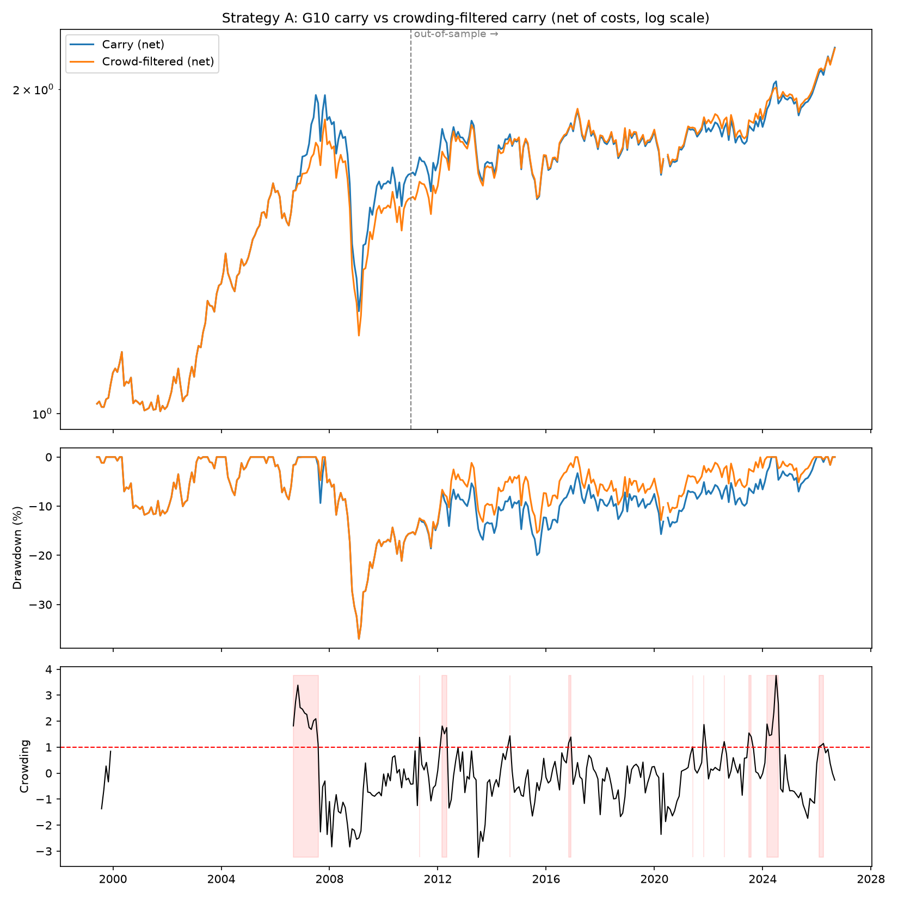
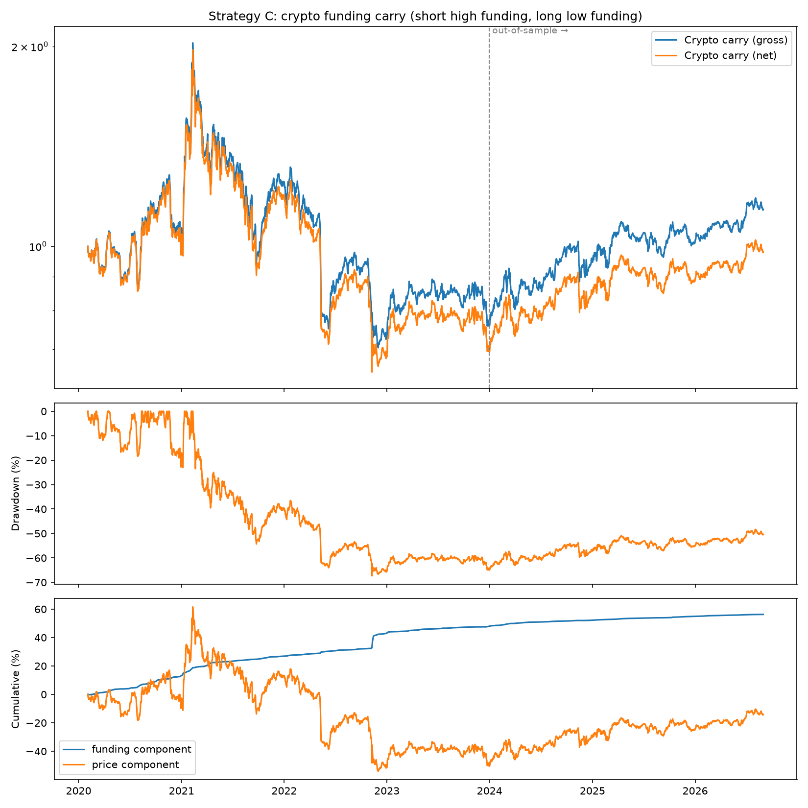
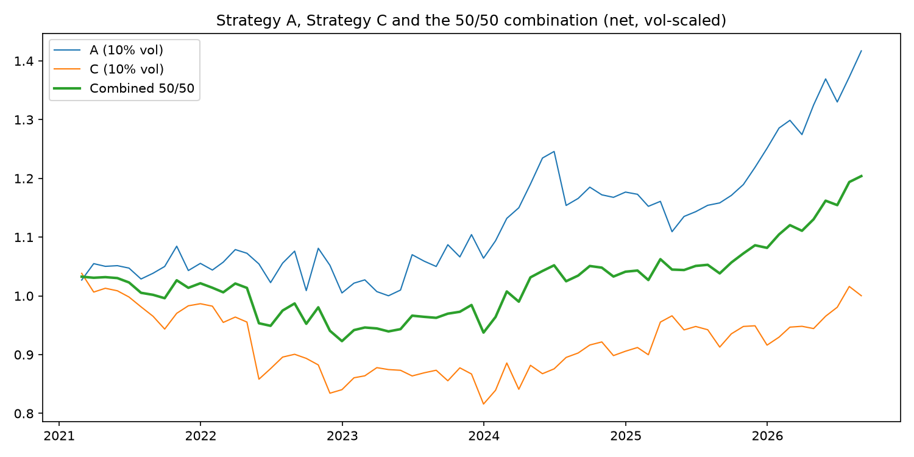

# Crowded Carry: Crash Risk in FX and Crypto Carry Trades

**MFE 230GB Currency Markets, final project**
Authors: Reza Zamani and Paraj Goyal

Interactive results page: [`web/index.html`](web/index.html) · Slides: [`slides/presentation.pptx`](slides/presentation.pptx) · Step-by-step notebooks: [`notebooks/`](notebooks/)

---

## 1. Project

A carry trade buys high-yielding assets and funds them with low-yielding ones. It earns a
premium on average, but that premium is widely interpreted as compensation for **crash risk**:
when many investors hold the same position and are forced to unwind at the same time, losses
are sudden and large (Brunnermeier, Nagel & Pedersen, 2008).

We study this mechanism in two markets that share the same economic structure but have very
different investors:

| | **Strategy A: crowded G10 carry** | **Strategy C: crypto funding carry** |
|---|---|---|
| Market | Developed-market currencies (OECD) | Crypto perpetual futures |
| Universe | JPY, EUR, GBP, CHF, CAD, AUD, NZD vs USD | 12 Binance USDT perpetuals, incl. delisted LUNA and FTT |
| Carry signal | 3-month interest rate differential vs USD | Perpetual-futures funding rate |
| Alternative data | CFTC Commitments of Traders (speculative positioning) | Funding rates as a measure of leveraged demand |
| Frequency | Monthly | Weekly rebalancing, daily P&L |
| Sample | 1999-05 to 2026-08 | 2020-02 to 2026-08 |

## 2. Purpose

1. Build two transparent, pre-specified carry strategies, one in developed FX and one in crypto,
   and measure their performance net of transaction costs.
2. Test whether a measurable notion of **crowding** identifies periods in which carry is more
   likely to crash, and whether acting on it improves risk-adjusted returns.
3. Describe when each strategy loses money and how much of its risk is systematic (volatility,
   dollar, crypto market) versus specific to individual assets.
4. Assess whether combining the two carry trades diversifies risk.

## 3. Research questions

1. **RQ1.** Does a G10 currency carry portfolio earn a positive risk-adjusted return after costs,
   and does it reproduce the academic carry factor?
2. **RQ2.** Does crowding, measured by CFTC speculative positioning, predict weaker or more
   crash-prone carry returns, and does scaling down exposure when the trade is crowded improve
   performance out of sample?
3. **RQ3.** When does FX carry lose money? In particular, is it exposed to volatility shocks and
   the dollar factor?
4. **RQ4.** Does a cross-sectional crypto funding-carry strategy (short high-funding coins, long
   low-funding coins) earn a premium after costs, and does that return come from funding or from
   price moves?
5. **RQ5.** What drives crypto carry losses, and does a simple pre-specified risk control reduce
   them without destroying returns?
6. **RQ6.** Are FX carry and crypto carry correlated, and does a combined portfolio diversify?

## 4. Hypotheses

The hypotheses and all trading parameters were written down before the backtests were run.

**Strategy A (crowded G10 carry)**

- **H0-A1:** The G10 carry portfolio has zero expected excess return after costs.
  **H1-A1:** It has a positive expected excess return (a carry premium).
- **H0-A2:** Next-month carry returns are the same after crowded and non-crowded months.
  **H1-A2:** After crowded months, carry returns are lower and more negatively skewed, so
  scaling down exposure when crowded raises the out-of-sample Sharpe ratio.
- **H0-A3:** Carry returns are unrelated to volatility shocks.
  **H1-A3:** Carry loses when global volatility rises (negative beta to volatility innovations).

**Strategy C (crypto funding carry)**

- **H0-C1:** A portfolio short high-funding and long low-funding perpetuals has zero expected
  return after costs.
  **H1-C1:** It earns a positive premium, mainly from the funding it collects.
- **H0-C2:** Its returns are driven by the overall crypto market.
  **H1-C2:** Being dollar-neutral, it has little exposure to BTC; its risk is in individual coins,
  and it crashes when crowded positions unwind, as in FX.

## 5. Data

| Data | Source | Series / coverage | Used for |
|---|---|---|---|
| FX spot rates | FRED (Fed H.10), daily → month-end | DEXJPUS, DEXUSEU, DEXUSUK, DEXSZUS, DEXCAUS, DEXUSAL, DEXUSNZ (DEXGEUS optional) | Strategy A returns |
| 3-month interbank rates | OECD via FRED, monthly | IR3TIB01xxM156N (US, JP, EZ, UK, CH, CA, AU, NZ, DE) | Strategy A carry signal |
| Speculative positioning | CFTC Commitments of Traders, legacy futures-only, weekly | CME currency futures, 1986–2026 | Strategy A crowding signal |
| Crypto prices, volume, funding | Binance public data archive (data.binance.vision), USDT-M perpetuals | Daily candles and 8-hourly funding, 2020-01 to 2026-08 | Strategy C |
| Carry factor portfolios | Lustig, Roussanov & Verdelhan, *CurrencyPortfolios.xls* (course file) | Developed-country HML, RX and equity-volatility innovations, 1983–2021 | Validation and risk regressions |

All data were downloaded on 2026-10-02. Coverage of the cleaned data (`data/clean/`):

- **FX spot:** JPY, GBP, CHF, CAD, AUD, NZD from 1971-01; EUR from 1999-01 (pre-euro DEXGEUS not
  yet available). All to 2026-09.
- **3-month rates:** long histories for USD, EUR/DEM, GBP, CAD, AUD and NZD, but **JPY only from
  2002-04** and **CHF from 1999-07**; GBP ends 2026-01.
- **CFTC positioning:** CAD, CHF, EUR (Deutsche mark before 1999), GBP and JPY from 1986-01, AUD
  from 1987-01, NZD from 1999-01 (no NZD contract from 2000-04 to 2003-11).
- **Crypto:** BTC, ETH, BNB, XRP, ADA, DOGE, SOL, LTC, LINK, AVAX, LUNA, FTT, plus USDC as a
  stablecoin sanity check (not traded). Average annualised funding is about 12–15% on the main
  coins (BTC 11.8%, ETH 13.9%, XRP 14.7%) and positive on 81–88% of days.

## 6. Methods

The tools and techniques used:

- **Currency excess returns.** For each currency,
  `rx_t = (1 + i_k,t-1 / 1200) · S_t / S_t-1 − (1 + i_US,t-1 / 1200)`, with S in USD per foreign
  unit. This is the return on a forward position under covered interest parity.
- **Rate-differential carry sort (A).** At each month-end, rank the 7 currencies by
  `i_k − i_US`; go long the 2 highest and short the 2 lowest, 0.5 weight each (dollar-neutral).
- **CFTC crowding z-score (A).** Net speculative positioning = (non-commercial long − short) /
  open interest, z-scored over a 36-month rolling window (minimum 24). Portfolio crowding =
  average z of the long leg minus average z of the short leg. When crowding > 1, positions are
  scaled to 50%.
- **Funding-rate sort (C).** Signal = trailing 7-day average daily funding. Every Sunday, short the
  top third of coins by funding and long the bottom third, equal weights, each leg 50% of capital.
  Daily P&L per coin = side × price return − side × funding paid (a short receives positive funding).
- **Return decomposition (C).** P&L split into the funding component and the price component.
- **Newey-West regressions.** Monthly Strategy A returns on the dollar factor (RX) and equity-
  volatility innovations (3 lags); daily Strategy C returns on BTC returns (7 lags).
- **Performance statistics.** Annualised mean, volatility and Sharpe ratio (×12 monthly, ×365
  daily), maximum drawdown, skewness, worst period, hit rate and turnover.
- **Risk targeting.** For the combined portfolio, each strategy is scaled to 10% annual volatility
  using trailing volatility known at t−1 (36 months for A, 12 for C), then combined 50/50.

## 7. Methodology

The research design, chosen to keep the tests honest:

- **Pre-specified parameters.** Legs, windows, thresholds, lookbacks, rebalancing and costs were
  fixed before running the backtests and were not changed afterwards.
- **In-sample / out-of-sample split.** Strategy A: in-sample 1999–2010, out-of-sample 2011–2026.
  Strategy C: in-sample 2020–2023, out-of-sample 2024–2026.
- **Transaction costs.** 3 bp per unit of turnover for G10 FX, 5 bp for crypto perpetuals. Results
  are reported gross and net.
- **No look-ahead.** Weights formed at the end of period t earn period t+1's return. CFTC positions
  (as of Tuesday) are used only after their Friday release (3-day lag). Crypto signals use funding
  up to the previous day.
- **Survivorship bias.** LUNA and FTT, which collapsed in 2022, stay in the universe. A coin is
  tradable only on days with a price **and** positive volume, which removes LUNA after 2022-05 and
  FTT after 2022-11-14 (Binance's archive keeps a frozen FTT price after that date).
- **Data integrity fixes.** Pre-August-2000 CFTC currency futures are reported under the exchange
  name "INTERNATIONAL MONETARY MARKET"; matching both exchange names extends positioning back to
  1986. Only the 5 days missing from Binance's archive are forward-filled.
- **Robustness reported, not used for tuning.** Grids over the crowding threshold and exposure (A)
  and over lookback × rebalancing (C) are reported in full; the headline results remain the
  pre-specified ones.
- **External validation.** Strategy A is compared with the Lustig–Roussanov–Verdelhan developed
  HML carry factor.
- **One risk control, fixed in advance (C).** Cap each coin at 1/6 of its leg, and exclude from the
  long leg any coin whose 7-day funding is below −50% a year. Reported next to the base case,
  whatever the outcome.

## 8. Results

All numbers below are read from the files in [`output/`](output/). Returns are net of
transaction costs unless stated otherwise.

### 8.1 Strategy A: G10 carry and the crowding filter (RQ1, RQ2)



| Net of costs | Period | Ann. mean | Ann. vol | Sharpe | Max DD | Skew | Turnover |
|---|---|---|---|---|---|---|---|
| Carry | Full 1999-05 to 2026-08 | 3.27% | 8.91% | 0.37 | −37.0% | −0.49 | 1.2x |
| Carry | In-sample 1999–2010 | 4.96% | 10.55% | 0.47 | −37.0% | −0.71 | 1.6x |
| Carry | Out-of-sample 2011–2026 | 2.01% | 7.46% | 0.27 | −15.5% | −0.10 | 0.9x |
| Crowd-filtered | Full | 3.23% | 8.55% | 0.38 | −37.0% | −0.45 | 2.0x |
| Crowd-filtered | In-sample | 4.47% | 10.12% | 0.44 | −37.0% | −0.69 | 1.8x |
| Crowd-filtered | Out-of-sample | 2.31% | 7.16% | **0.32** | −14.4% | −0.02 | 2.1x |

Carry returns in the month after crowded vs non-crowded months:

| | Months | Next-month mean | Next-month vol | Skewness |
|---|---|---|---|---|
| Not crowded | 295 | 0.30% | 2.56% | −0.46 |
| Crowded | 33 | **0.02%** | 2.67% | −0.71 |

Robustness (net Sharpe): full sample 0.35–0.38 and out-of-sample 0.30–0.40 across crowding
thresholds of 0.5, 1.0 and 1.5 and crowded exposure of 0% or 50%.

**Validation (RQ1).** Over 1999-05 to 2021-05 (264 months), Strategy A has a **0.82 correlation**
with the LRV developed HML factor. Strategy A: 3.22% a year, Sharpe 0.34; LRV HML: 2.34%, Sharpe
0.23.

### 8.2 Strategy A: when does it lose money? (RQ3)

Monthly net carry regressed on factors, 1999-05 to 2021-05, Newey-West t-statistics:

| Model | Dollar factor (RX) | Volatility innovation | Monthly alpha | R² |
|---|---|---|---|---|
| RX only | 0.42 (t = 4.4) | – | 0.26% (t = 1.6) | 0.12 |
| Volatility only | – | −1.93 (t = −4.3) | 0.26% (t = 1.6) | 0.10 |
| Both | 0.35 (t = 4.1) | **−1.55 (t = −3.7)** | 0.25% (t = 1.7) | 0.18 |

Worst months: 2008-10 (−12.0%), 2007-08 (−7.8%), 2000-05 (−7.0%), 2009-01 (−6.8%), 2008-03
(−6.5%), 2015-01 (−6.4%, the Swiss franc de-peg). From July 2008 to March 2009 the strategy lost
**−20.5%**.

### 8.3 Strategy C: crypto funding carry (RQ4)



| | Period | Ann. mean | Ann. vol | Sharpe | Max DD | Worst week | Turnover |
|---|---|---|---|---|---|---|---|
| Gross | Full 2020-02 to 2026-08 | 6.38% | 29.87% | 0.21 | −66.0% | −27.2% | 45x |
| Net | Full | 4.13% | 29.87% | **0.14** | −67.3% | −27.3% | 45x |
| Net | In-sample 2020–2023 | −2.52% | 36.05% | −0.07 | −67.3% | −27.3% | 45x |
| Net | Out-of-sample 2024–2026 | 13.87% | 17.21% | **0.81** | −13.3% | −9.2% | 44x |

Where the return comes from (% a year):

| Period | Funding | Price | Costs | Net |
|---|---|---|---|---|
| Full | +8.55 | −2.17 | −2.25 | +4.13 |
| In-sample | +12.26 | −12.51 | −2.27 | −2.52 |
| Out-of-sample | +3.10 | +12.99 | −2.22 | +13.87 |

Robustness, lookback × rebalancing (net Sharpe, full / out-of-sample): 3 days daily 0.68 / 0.41;
3 days weekly 0.49 / 1.29; 7 days daily 0.56 / 0.92; **7 days weekly (pre-specified) 0.14 / 0.81**;
30 days daily 0.28 / 0.83; 30 days weekly 0.07 / 0.42.

### 8.4 Strategy C: what drives the losses? (RQ5)

- **No market exposure.** Beta to daily BTC returns is −0.018 (Newey-West t = −0.75).
- **Worst weeks:** 2022-05-15 −27.3% (LUNA), 2021-09-12 −12.3%, 2022-11-13 −11.6% (FTX), 2020-11-29
  −11.0%, 2021-08-15 −10.0%. In the LUNA week the strategy was *long* LUNA: its funding had turned
  negative as traders shorted it, so the rule placed it in the long leg.
- **Losses are coin-specific.** Total P&L contribution (sum of daily % points): LUNA −87, XRP −58,
  DOGE −44, FTT −13; SOL +102, BNB +51, AVAX +36, ADA +32, LINK +27.

Pre-specified risk control (1/6 cap per coin plus a −50% funding filter on the long leg):

| Net | Sharpe full | Sharpe OOS | Max DD | Worst week | Avg gross exposure |
|---|---|---|---|---|---|
| Base | 0.14 | 0.81 | −67.3% | −27.3% | 1.00 |
| Risk-controlled | −0.16 | 0.74 | −43.3% | −18.9% | 0.49 |

### 8.5 Combined portfolio (RQ6)



Each strategy scaled to 10% volatility, 2021-02 to 2026-08 (67 months):

| | Ann. mean | Ann. vol | Sharpe | Max DD | Worst month |
|---|---|---|---|---|---|
| A (10% vol) | 6.70% | 9.43% | 0.71 | −11.0% | −7.4% |
| C (10% vol) | 0.44% | 9.28% | 0.05 | −21.4% | −10.2% |
| Combined 50/50 | 3.57% | 6.96% | 0.51 | −10.6% | −5.9% |

The correlation between A and C is **0.11** (0.12 for unscaled monthly net returns, 78 months).

## 9. Discussion

**Interpretation.**

- **Strategy A (RQ1–RQ3).** G10 carry earns a modest premium (net Sharpe 0.37) and closely tracks
  the academic carry factor (correlation 0.82), so H0-A1 is rejected in economic terms. Its
  losses line up with volatility shocks (beta −1.55, t = −3.7), and the alpha is not significant
  once the dollar and volatility factors are included. This is the textbook picture: carry is
  compensation for crash risk, not a free lunch (H1-A3 supported).
- **Crowding (RQ2).** The evidence leans towards H1-A2 but is not decisive. After crowded months,
  carry earns almost nothing (0.02% vs 0.30%) and is more negatively skewed. The filter raises the
  out-of-sample Sharpe from 0.27 to 0.32 and the result holds across the robustness grid. But with
  only 33 crowded months the difference is imprecise, and the 2008 crash started from a
  non-crowded reading, so the filter did not avoid the largest drawdown.
- **Strategy C (RQ4–RQ5).** Crypto carry collects real funding income (+8.6% a year), but price
  moves dominate. In 2020–2023 the shorted, crowded-long coins kept rallying and wiped out the
  funding; since 2024 most of the gain came from price, not funding. The strategy has no BTC
  exposure (H1-C2 supported on beta), but its crashes are coin-specific and arise in the opposite
  way to FX. Because it buys the coins with the most negative funding, it ends up long whatever
  traders are shorting hardest. In 2022 that meant being long LUNA and FTT into their collapse.
- **Risk control.** The pre-specified control did not help. The cap mostly halved exposure (3–4
  coins per leg), LUNA's funding crossed the filter only mid-week, and the filter blocked BNB and
  SOL, the two biggest winners. In crypto, deeply negative funding usually signals crowded *shorts*
  rather than distress.
- **Diversification (RQ6).** FX and crypto carry are nearly uncorrelated (0.11), so the 50/50 mix
  has lower volatility (7.0%) and a smaller drawdown than either part. Because C was weak during
  the overlap, the combination does not beat A alone on Sharpe.

**Limitations.**

- **DEXGEUS is missing,** so EUR spot starts in 1999. Together with JPY rates (2002) and CHF rates
  (1999), this means Strategy A effectively starts in 1999-05.
- **The crypto sample is short (about 6.5 years) with only 12 coins.** Each leg holds just 3–4
  coins, so single-coin events dominate.
- **Strategy C reverses between in-sample (Sharpe −0.07) and out-of-sample (0.81).** The
  out-of-sample period is short and benefited from price moves, so it should not be read as
  evidence of a stable premium.
- **Results depend on the signal horizon.** Shorter lookbacks and daily rebalancing perform better
  even after costs. We report the pre-specified case and do not switch after seeing the grid.
- **The LUNA episode shows a structural weakness** of funding-sorted portfolios, and the one risk
  control we tested did not fix it.
- **The LRV factors end in 2021-05,** so the volatility regressions cover 1999–2021 only.
- **Costs are simple per-unit estimates.** Funding caps, borrow constraints, slippage under stress
  and exchange counterparty risk are not modelled.

**Implications.** Carry premia in both markets look like compensation for crash risk. In FX,
crowding measured from positioning data is informative at the margin and cheap to use as an
overlay. In crypto, funding rates measure leveraged demand, but sorting on them alone exposes the
portfolio to idiosyncratic collapses. A better design would react faster than weekly (the robustness
grid points that way), treat extreme negative funding as a sign of crowded shorts, and size
positions by coin-level risk. Because FX and crypto carry crash at different times, they combine
well in a diversified carry portfolio.

---

## Repository structure

```
code/          numbered scripts, run in order (see run_all.py)
  01_download_data_strategyA.py   FX, rates, CFTC  -> data/clean/
  02_backtest_strategyA.py        Strategy A backtest -> output/strategyA/
  03_download_data_strategyC.py   Binance prices and funding -> data/clean/
  04_backtest_strategyC.py        Strategy C backtest -> output/strategyC/
  05_risk_analysis.py             LRV check, risk, risk control, combined -> output/risk/
  06_build_web.py                 interactive page -> web/index.html
  07_build_slides.py              presentation -> slides/presentation.pptx
notebooks/     step-by-step Jupyter versions of the scripts (01-05)
data/raw/      downloaded files (not committed; re-created by the scripts)
data/clean/    processed data snapshot used for all results (committed)
output/        tables and figures
web/           interactive HTML page
slides/        presentation
ai_log.md      documentation of AI-assisted work
```

## How to reproduce

```bash
conda create -n carry python=3.12 -y   # or use your own environment
conda activate carry
pip install -r requirements.txt
SKIP_DOWNLOAD=1 python run_all.py      # analysis, page and slides from the committed data/clean snapshot
python run_all.py                      # full pipeline including downloads
```

- **`SKIP_DOWNLOAD=1`** skips all downloads and reproduces every result from the committed
  `data/clean/` snapshot, without network access.
- **FRED files must be downloaded by hand** for a full rebuild. FRED's website often drops
  scripted requests. Save each series from fred.stlouisfed.org (Download → CSV) as
  `data/raw/fred_<SERIES_ID>.csv`, e.g. `data/raw/fred_IR3TIB01USM156N.csv`. Alternatively, set
  `FRED_API_KEY` (free key from fredaccount.stlouisfed.org) to use the official API.
- **`code/05_risk_analysis.py` needs the course file `CurrencyPortfolios.xls`** in `data/raw/`;
  the sections that use it are skipped if it is absent. A hand-saved `data/raw/fred_VIXCLS.csv`
  is used if present.
- **Notebooks.** `notebooks/01`–`05` import the functions in `code/`, so their results match the
  scripts. By default they use `data/clean/`; set `DOWNLOAD = True` in notebooks 01 and 03 to
  re-download.

  ```bash
  python -m ipykernel install --user --name carry --display-name "Python (carry)"
  jupyter lab notebooks/
  ```

## AI use

AI assistance was used for code, documentation drafts, the web page and the slides, as the course
allows. What was asked, what was produced, what we decided ourselves and how we checked the output
is documented in [`ai_log.md`](ai_log.md).
